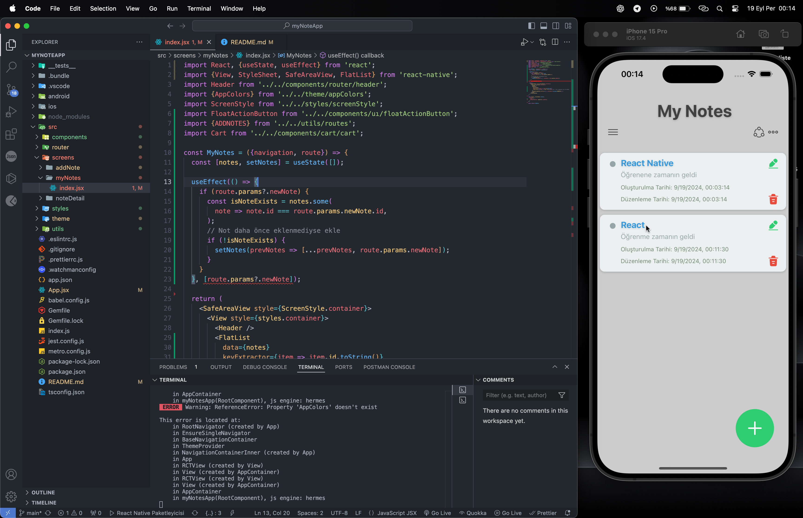
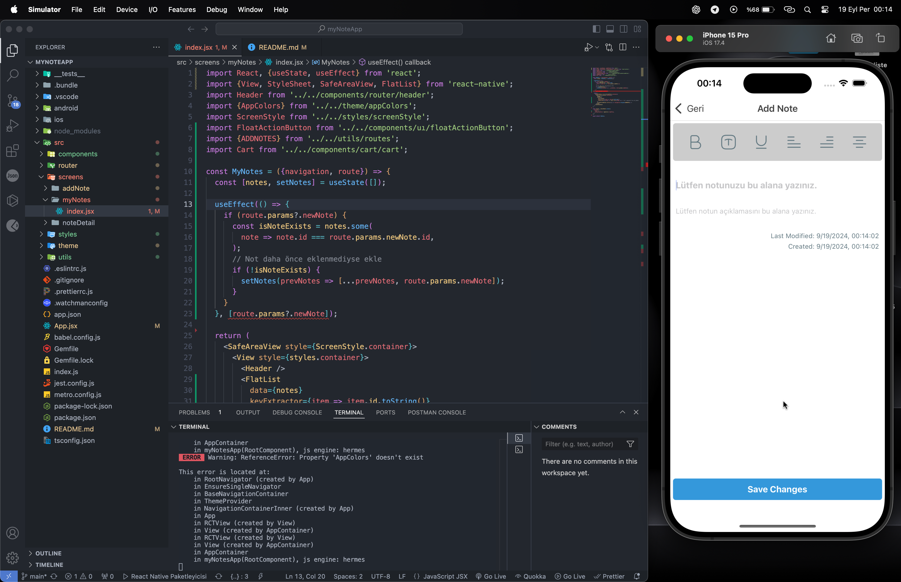
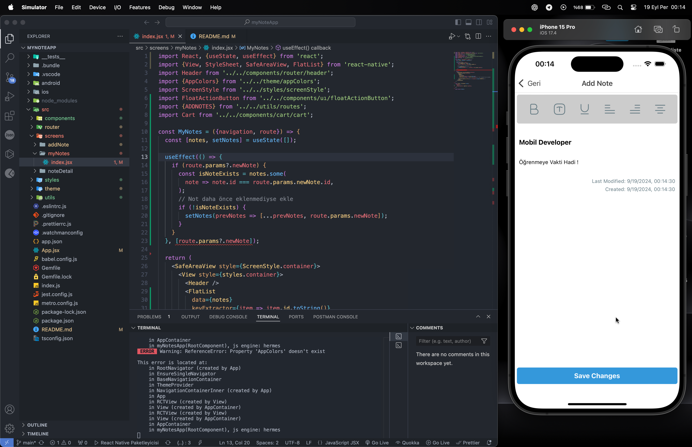
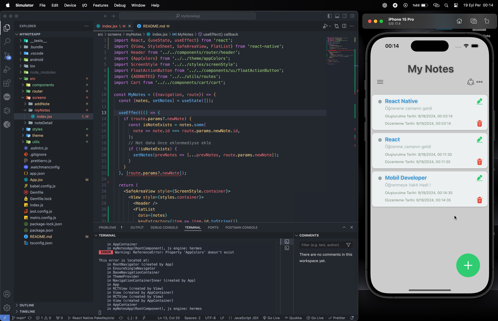
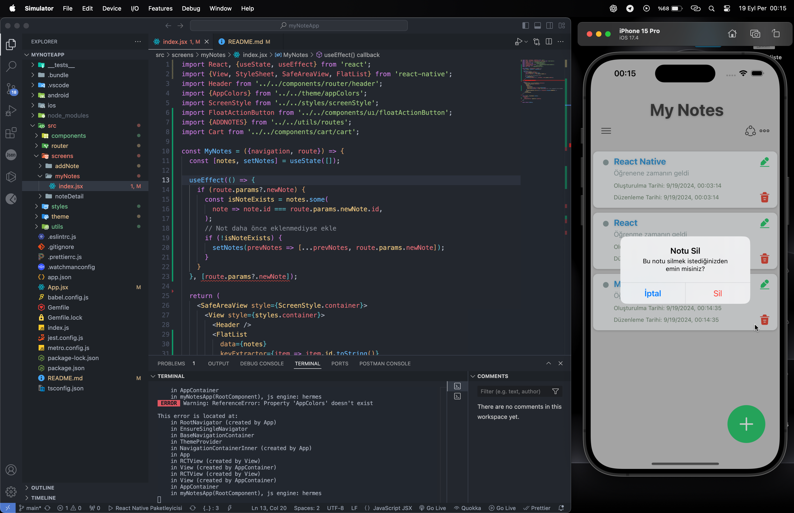

# React Native Notes App

## Proje Açıklaması

Bu React Native uygulaması, notları yönetmek için tasarlanmıştır. Kullanıcılar not ekleyebilir, görebilir, düzenleyebilir ve silebilir. Uygulama, ekranlar arasında geçiş yapmak için React Navigation ve ikonlar için iconsax-react-native paketlerini kullanır.

## Özellikler

- **Not Ekleme:** Kullanıcılar başlık ve açıklama ile yeni notlar oluşturabilir.
- **Not Görüntüleme:** Tüm notların listesi görüntülenir.
- **Not Düzenleme:** Mevcut notların içeriği güncellenebilir.
- **Not Silme:** Notlar listeden kaldırılabilir.

## Yüklenen Kütüphaneler

- `@react-navigation/native`: ^6.1.18
- `@react-navigation/native-stack`: ^6.11.0
- `iconsax-react-native`: ^0.0.8
- `react`: 18.3.1
- `react-native`: 0.75.2
- `react-native-safe-area-context`: ^4.11.0
- `react-native-screens`: ^3.34.0
- `react-native-svg`: ^15.6.0

## Kurulum

1. **Depoyu Klonlayın:**

   ```bash
   git clone <depo-url>


## Assetler

Aşağıda uygulamanın asset klasöründeki fotoğraflar bulunmaktadır:





